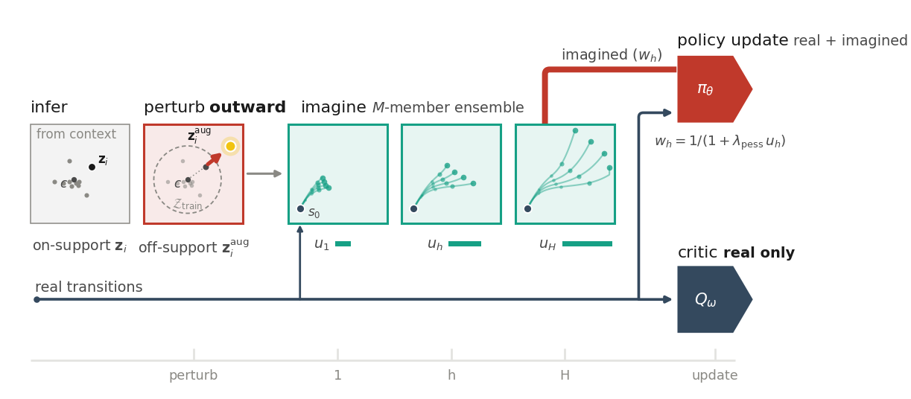

# PLATO: Pessimistic Latent Task-aware Optimization

Official implementation of **Pessimistic Latent Task-aware Optimization for Robust Offline Meta-Reinforcement Learning** (NeurIPS 2026).

Chang-Hoon Jeong, Kisung Shin, Hanwool Sul, Byoung-Tak Zhang (Seoul National University)

This implementation is built on the [ER-TRL](https://github.com/mohammadrezanakhaei/er-trl) codebase.



Context-based offline meta-RL trains the policy only on latents inferred from training tasks, so on a task beyond the training support the policy acts on a latent it has never seen. PLATO exposes the policy to such off-support latents at training time:

1. **Radial outward perturbation.** Each inferred latent is pushed outward from the batch centroid, off the training support.
2. **Imagined rollout.** A decoder ensemble, conditioned on the perturbed latent, rolls out short trajectories from real states.
3. **Pessimism-weighted policy update.** Each imagined step is weighted by `1 / (1 + λ_pess · u_h)`, where `u_h` is the ensemble disagreement; the critic is trained on real transitions only.

At test time PLATO is a standard context-based agent: no ensemble, rollout, or extra computation.

## Installation

```sh
conda env create -f environment.yml
conda activate plato
```

PLATO uses MuJoCo 2.1.0 through `mujoco-py`:

```sh
mkdir -p ~/.mujoco && cd ~/.mujoco
wget https://github.com/google-deepmind/mujoco/releases/download/2.1.0/mujoco210-linux-x86_64.tar.gz
tar -xzf mujoco210-linux-x86_64.tar.gz
export LD_LIBRARY_PATH=$LD_LIBRARY_PATH:$HOME/.mujoco/mujoco210/bin:/usr/lib/nvidia
```

On Ubuntu, `mujoco-py` also needs `sudo apt install libosmesa6-dev libgl1-mesa-glx libglfw3 patchelf`.

## Offline data

The offline dataset of each task is collected by a per-task SAC behaviour policy (Appendix F of the paper). Run the collector once for every task index (0 to 39) of an environment:

```sh
export PLATO_DATA_DIR=/path/to/offline_dataset
for i in $(seq 0 39); do
    python collect_data.py env=cheetah-vel goal_idx=$i
done
```

Trajectories are written to `$PLATO_DATA_DIR/<env_name>/goal_idx<i>/` (default `./offline_dataset`). Training reads the stochastic evaluation rollouts `trj_evalsample<k>_step<step>.npy`, 50 per checkpoint at 19 checkpoints between 100k and 1M SAC steps, each an array of `(s, a, r, s')` transitions.

## Training

```sh
export PLATO_DATA_DIR=/path/to/offline_dataset
python launch_experiment.py env=ant-dir algo=plato seed=0
```

- Environments: `ant-dir`, `ant-goal`, `cheetah-vel`, `humanoid-dir`, `hopper-mass`, `hopper-friction`, `walker-mass`, `walker-friction`.
- The per-environment hyperparameters of the paper (Appendix G, Table 5) are loaded automatically from `cfgs/algo_env/plato/<env>.yaml`.
- Every environment uses the same budget of 200,000 updates (100 iterations × 2,000 steps).
- Logs record returns on the training tasks (`train/*`) and on the out-of-support tasks (`extreme/*`). Weights & Biases logging is off by default; enable it with `use_wandb=true`.

The ablations of the paper are command-line overrides:

```sh
# no-direction: random unit vector instead of the centroid-outward direction
python launch_experiment.py env=ant-dir algo=plato algo_params.lore_random_dir=true
# no-weight: disable the pessimism weight
python launch_experiment.py env=ant-dir algo=plato algo_params.lambda_pess=0
# Q-synth: also train the critic on imagined transitions
python launch_experiment.py env=ant-dir algo=plato algo_params.q_use_synthetic=true
```

## Repository layout

| Path | Contents |
| --- | --- |
| `rlkit/torch/agents/plato.py` | PLATO: outward perturbation, decoder-ensemble rollout, pessimism-weighted update |
| `rlkit/torch/networks.py` | Context encoder, critics, decoder ensemble |
| `rlkit/envs/` | The eight MuJoCo task families and their train / out-of-support splits |
| `rlkit/torch/pytorch_sac/` | SAC behaviour policy used for data collection |
| `cfgs/` | Hydra configs (`env/`, `data/`, `algo/`, `algo_env/plato/`, `data_collection.yaml`) |
| `launch_experiment.py` | Training entry point |
| `collect_data.py` | Data-collection entry point |

## Citation

```bibtex
@inproceedings{jeong2026plato,
  title     = {Pessimistic Latent Task-aware Optimization for Robust Offline Meta-Reinforcement Learning},
  author    = {Jeong, Chang-Hoon and Shin, Kisung and Sul, Hanwool and Zhang, Byoung-Tak},
  booktitle = {Advances in Neural Information Processing Systems},
  year      = {2026}
}
```

## Acknowledgements

Our code starts from the official implementation of [ER-TRL](https://github.com/mohammadrezanakhaei/er-trl) (Nakhaei, Scannell, and Pajarinen, AAAI 2025), which in turn builds on [CSRO](https://github.com/MoreanP/CSRO). We sincerely thank the ER-TRL authors for making their code publicly available; the encoder, replay buffer, and BRAC actor-critic used here come from their implementation. The SAC data collector is adapted from [pytorch_sac](https://github.com/denisyarats/pytorch_sac).

## License

MIT (see [LICENSE](LICENSE)). Portions of the code derive from rlkit, ER-TRL, CSRO, and BRAC and retain their original copyrights; the data collector in `rlkit/torch/pytorch_sac/` keeps the MIT license of pytorch_sac.
